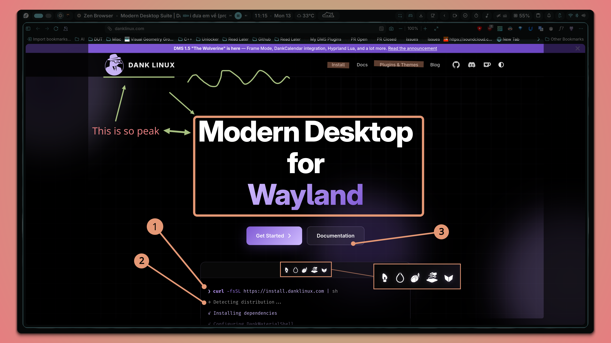

# DMS Quick Capture & Annotate

<p align="center">
  <a href="https://github.com/AvengeMedia/dms-plugin-registry/issues/432">
    
  </a>
</p>

Screenshot and vector annotation plugin for DankMaterialShell (DMS).



## Requirements

- DankMaterialShell >= 1.5.2 (scroll capture requires DMS >= 1.5.2)
- **ImageMagick** (provides `magick`/`mogrify`, required for WebP/JPEG exports, rotation/mirroring, and OCR/QR crop)
- **img2pdf** (required for PDF export)
- **tesseract** (required for OCR text scanner)
- **zbar** (provides `zbarimg`, required for QR scanner)

## Install

```bash
# Via DMS CLI
dms plugins install quickCapture

# Or manually
git clone https://github.com/hthienloc/dms-quick-capture ~/.config/DankMaterialShell/plugins/quickCapture
```

### Revert to a previous version

```bash
cd ~/.config/DankMaterialShell/plugins/quickCapture
git checkout v3.1.0    # replace with the desired version tag
```

To go back to the latest release:

```bash
git checkout v3.2.0
```

To track the development branch again:

```bash
git checkout main && git pull
```

## Quick Start

| Action | Result |
|--------|--------|
| **Left Click** (bar icon) | Open widget popout |
| **Middle Click** (bar icon) | Default action (configured in settings) |
| **Right Click** (bar icon) | Paste image or image URL from clipboard |
| **Drop Image** (bar icon) | Drag any image onto the icon to annotate |
| **<kbd>Print</kbd>** (keyboard) | Capture using default mode (requires keybind setup) |

**Typical workflow:**

1. **Trigger capture** — click the bar icon, use Control Center, or press <kbd>Print</kbd>.
2. **Select area** — drag to choose the screenshot region.
3. **Annotate** — use the toolbar, keyboard shortcuts, or radial menus.
4. **Finish** — press <kbd>Enter</kbd> (action depends on settings) or <kbd>Esc</kbd> to discard.
   - **Scroll mode**: select a region, scroll the content, then press <kbd>Enter</kbd> to finish stitching. Adjust scroll interval in settings.

## Annotation Tools

### Tool Selection

| Shortcut | Tool |
|----------|------|
| <kbd>1</kbd> | Pen |
| <kbd>2</kbd> | Line |
| <kbd>3</kbd> | Arrow |
| <kbd>4</kbd> | Rectangle |
| <kbd>Q</kbd> | Ellipse |
| <kbd>W</kbd> | Text |
| <kbd>E</kbd> | Pixelate |
| <kbd>R</kbd> | Redact |
| <kbd>A</kbd> | Stamp |
| <kbd>S</kbd> | Highlighter |
| <kbd>D</kbd> | Focus Spotlight |
| <kbd>F</kbd> | Color Picker (Ink/Eyedropper) |
| <kbd>T</kbd> | Eraser |
| <kbd>Z</kbd> | Area Zoom (Callout) |
| <kbd>B</kbd> | Backdrop Options |
| <kbd>V</kbd> | Select |
| <kbd>X</kbd> | Toggle Hide/Show Annotations |
| <kbd>Tab</kbd> | Toggle between 2 latest radial presets |

### Drawing & Editing

- **Thickness:** Scroll **Mouse Wheel** to scale brush / font size.
- **Quick Erase:** **Middle-click** on any element to delete it.
- **Copy / Duplicate:** Select a vector with the **Select** tool (<kbd>V</kbd>), then press **<kbd>C</kbd>** to duplicate. Pressing **<kbd>C</kbd>** without a selection pastes the last copied vector at the cursor.
- **Undo:** <kbd>Ctrl</kbd> + <kbd>Z</kbd>.
- **Shift Constraint:** Hold **<kbd>Shift</kbd>** while drawing to constrain shapes:

  | Tool | Shift Behavior |
  |------|----------------|
  | Pen | Draws straight lines |
  | Line, Arrow, Highlighter | Snaps angle to 15° increments |
  | Ellipse | Perfect circle |
  | Rectangle, Redact, Pixelate | Perfect square |

### Popover Toolbars & Radial Menus

| Interaction | Menu / Popover |
|-------------|----------------|
| **Right-click** on canvas | 8 customizable tool presets |
| **<kbd>Shift</kbd>+Right-click** (Stamp active) | Open Stamp Options mini-toolbar (Numeric, Alphabetic, Roman) |
| **<kbd>Shift</kbd>+Right-click** (Text active) | Open Text Options mini-toolbar (Bold, Italic, Underline, Background) |
| **<kbd>Shift</kbd>+Right-click** (Line active) | Open Line Options mini-toolbar (Solid, Dashed, Dotted) |

### Special Tools

- **Magnifier Lens:** Hold **<kbd>G</kbd>** to activate a magnifying circular lens. Scroll **Mouse Wheel** while holding **<kbd>G</kbd>** to adjust zoom (1.5× – 4×).
- **Area Zoom (Callout):** Press **<kbd>Z</kbd>** to draw a magnified callout box. Adjust zoom (100%–500%) with scroll wheel.
- **Text Tool:** Supports Bold, Italic, Underline, and auto-contrast Background via the radial menu.

## Keyboard Shortcuts

| Key | Action |
|-----|--------|
| <kbd>Enter</kbd> | Done (save/copy per settings) |
| <kbd>Esc</kbd> | Discard & Close |
| <kbd>Ctrl</kbd> + <kbd>Z</kbd> | Undo last stroke |
| <kbd>Ctrl</kbd> + <kbd>S</kbd> | Save to file |
| <kbd>Ctrl</kbd> + <kbd>C</kbd> | Copy to clipboard |
| <kbd>Ctrl</kbd> + <kbd>A</kbd> | Copy & Save |
| <kbd>Ctrl</kbd> + <kbd>F</kbd> | Float image to always-on-top window |
| <kbd>Ctrl</kbd> + <kbd>X</kbd> | Crop / Resize |
| <kbd>Ctrl</kbd> + <kbd>1</kbd> – <kbd>4</kbd> | Select color slots 1 – 4 |
| <kbd>Ctrl</kbd> + <kbd>Q</kbd> – <kbd>R</kbd> | Select color slots 5 – 8 (Q, W, E, R) |

## Pin-to-Desktop (Float)

- **<kbd>Ctrl</kbd> + <kbd>F</kbd>** in the annotator to export and float the image instantly.
- **Left-click** the floating image to return it to the annotator for further editing.
- **Right-click** the floating image to minimize it into a small cloud icon.
- **Hover** the cloud icon to restore the floating image.
- **Middle-click** the floating image to close it.

## IPC Commands

Commands that capture or open images accept an `action` parameter — use `edit` to open the editor or `float` to spawn an always-on-top window.

```bash
dms ipc call quickCapture <command> [arg] edit|float

dms ipc call quickCapture screenshot region edit   # open editor
dms ipc call quickCapture screenshot region float  # float directly
```

| Command | Arguments | Description |
|---------|-----------|-------------|
| `screenshot` | `mode` (`default`, `region`, `full`, `all`, `output`, `window`, `last`, `scroll`) | Trigger capture |
| `selectFile` | — | Open file browser to pick an image |
| `fromClipboard` | — | Annotate image from clipboard |
| `openImage` | `path` | Open a specific image in the annotator |
| `close` | — | Close the annotator window |
| `showHistory` | — | Open Recent Edits history carousel |

### Keybinding Examples (Niri)

```kdl
binds {
    Print { spawn "dms" "ipc" "call" "quickCapture" "screenshot" "region" "edit"; }
    Meta+Print { spawn "dms" "ipc" "call" "quickCapture" "screenshot" "window" "edit"; }
    # Float without editor:
    # Control+Print { spawn "dms" "ipc" "call" "quickCapture" "screenshot" "full" "float"; }
}
```

## Roadmap

- [x] OCR (Optical Character Recognition) text scanner
- [x] QR Code Scanner
- [x] Canvas Color Picker (Eyedropper tool)
- [ ] Image Filters (Grayscale, negative, brightness/contrast)
- [ ] Image Backdrop Mode: Support setting a custom image file as the screenshot background
- [x] Expanded tool option popovers:
  - **Arrow tool**: Double-headed arrows, line styles (dashed, dotted)
  - **Line tool**: Line styles (dashed, dotted)
  - **Rectangle tool**: Border styles (dashed, dotted)
  - **Redact tool**: Clean text eraser (dominant color/gradient background matcher)
  - **Callout tool**: Ellipse callout shape support

## Credits

- **[Gradia Capture](https://github.com/AlexanderVanhee/gradia-capture)** — Inspiration for the toolbar layout and backdrop algorithms
- **[Flameshot](https://github.com/flameshot-org/flameshot)** — Inspiration for the radial menu and tool interaction patterns
- **[Snapzy](https://github.com/duongductrong/Snapzy)** — Inspiration for the float image / continue-editing workflow
- **vky** and **bodify** (Discord) — Actively reporting bugs and contributing valuable feedback to help polish and improve the plugin

Thanks to everyone who supported, contributed code, gave feedback, and the DankMaterialShell community.


## License

MIT
