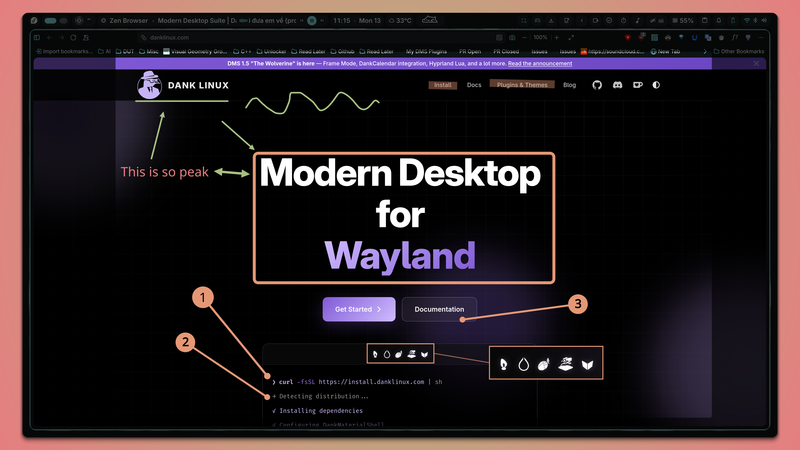

# DMS Quick Capture & Annotate

<p align="center">
  <a href="https://github.com/AvengeMedia/dms-plugin-registry/issues/432">
    
  </a>
</p>

Screenshot annotation plugin for DankMaterialShell.



## Documentation

- **[User Guide](docs/user-guide.md)**: capture workflow, annotation tools, shortcuts, floating images, and IPC commands.
- **[Documentation Index](docs/index.md)**: architecture, annotation engine, settings reference, and contributor documentation.
- **[Rust Backend Architecture](docs/rust-backend-architecture.md)**: capture flow, selector state, coordinates, scaling, scroll capture, and compositor fallbacks.

## Requirements

| Dependency | Purpose |
| --- | --- |
| DankMaterialShell >= **1.5.2** | Required for scrolling capture |
| **ImageMagick** (`magick`/`mogrify`) | WebP/JPEG exports and OCR/QR crop |
| **img2pdf** | PDF export |
| **tesseract** | OCR text scanner |
| **zbar** (`zbarimg`) | QR scanner |
| **Rust screenshot backend** | Installed separately when the New Backend is selected |
| **curl** and **sha256sum** | Verify and install the Rust backend release asset |

## Install

Via DMS CLI:

```bash
dms plugins install quickCapture
```

Or manually:

```bash
git clone https://github.com/hthienloc/dms-quick-capture ~/.config/DankMaterialShell/plugins/quickCapture
```

The New Backend is distributed as a GitHub Release asset and installed separately after verifying its checksum. For installation and backend development, see the [`dms-screenshot-rs` README](dms-screenshot-rs/README.md).

### Build the Rust backend locally

Users who prefer to build from source can install the required tools and dependencies, then run:

```bash
sudo dnf install rust cargo cairo-devel libXcursor-devel
git clone https://github.com/hthienloc/dms-quick-capture
cd dms-quick-capture
./scripts/update-bundled-backend.sh
```

The script builds an optimized binary and installs it into `backend/<architecture>/` inside the plugin. Select **New Backend** in Quick Capture settings after the build completes.

## Credits

- **[Gradia Capture](https://github.com/AlexanderVanhee/gradia-capture)** — Inspiration for the toolbar layout and background algorithms
- **[Flameshot](https://github.com/flameshot-org/flameshot)** — Inspiration for the radial menu and tool interaction patterns
- **[Snapzy](https://github.com/duongductrong/Snapzy)** — Inspiration for the float image / continue-editing workflow
- **vky** and **bodify** (Discord) — Bug reports and feedback that helped polish the plugin

Thanks to everyone who supported, contributed code, gave feedback, and helped the DankMaterialShell community.

## License

MIT
